<center>

----   
# Materialize
----
</center>

# INDICE 

  1. [Introducción](#1-Introducción)
  2. [Qué es una base de datos de flujo continuo?](#2-¿Qué-es-una-base-de-datos-de-flujo-continuo?)
  3. [¿Cómo funcionan las bases de datos en flujo continuo?](#3-¿Cómo-funcionan-las-bases-de-datos-en-flujo-continuo?)
  4. [Bases de datos en streaming Vs bases de datos relacionales tradicionales](#4-Bases-de-datos-streaming-Vs-Bases-de-datos-flujo-continuo)
  5. [Que es Materilize?](#5-¿Que-es-Materialize?)
  6. [Ventajas](#6-ventajas)
  7. [Desventajas](#7-desventajas)
  8. [Caso de Uso](#8-caso-de-uso)
  9. [Demo](#9-demo)

 


# 1. Introducción

En el mundo actual, impulsado por los datos, las empresas y organizaciones recopilan y analizan datos constantemente para obtener información y tomar mejores decisiones. Sin embargo, el enfoque tradicional de almacenamiento y procesamiento de datos por lotes ya no es suficiente para satisfacer las exigencias del procesamiento de datos en tiempo real. La solución: las bases de datos de flujo continuo.

Diseñadas para gestionar flujos de datos de gran velocidad y volumen en tiempo real, las bases de datos de flujo pueden recibir y procesar los datos a medida que llegan, sin necesidad de procesamiento por lotes. Esto las hace ideales para aplicaciones como sensores de Internet de las Cosas (IoT), análisis de redes sociales, sistemas de comercio financiero, etc.


# 2. ¿Qué es una base de datos de flujo continuo?

Una base de datos de flujo puede definirse como un repositorio de datos en tiempo real para almacenar, acumular, procesar y mejorar un flujo de datos. Un flujo de datos, a su vez, es la corriente/flujo de datos que se genera continuamente a partir de múltiples fuentes. Los flujos de datos se procesan de forma incremental mediante técnicas de procesamiento de flujos sin necesidad de acceder inicialmente a los datos completos.

Sin embargo, el término "base de datos de flujo" no se limita a un sistema individual de gestión de bases de datos de clases discretas. De hecho, se extiende a numerosas bases de datos que manejan datos de flujo en tiempo real. Las bases de datos que manejan estos datos en flujo pueden pertenecer a cualquier categoría de bases de datos, es decir, bases de datos NoSQL, bases de datos NewSQL y bases de datos de series temporales.


# 3. ¿Cómo funcionan las bases de datos en flujo continuo?

Cuando un flujo de datos llega a una base de datos de streaming en tiempo real, se procesa inmediatamente. Esos datos pueden utilizarse directamente en su aplicación después de ser analizados.

Las entradas de datos a una base de datos de streaming se denominan flujos de datos. Estos flujos de datos son eventos de secuencias append-only y son inmutables. Los datos de entrada a una base de datos se clasifican en dos niveles.

El primer nivel es el flujo, mientras que el segundo nivel lo construye el usuario basándose en el comportamiento de estos flujos, lo que puede denominarse estadísticas de eventos. Este análisis del flujo de entrada se almacena en columnas y tablas del mismo modo que en una base de datos relacional tradicional. La siguiente imagen presenta el diagrama de flujo del funcionamiento de una base de datos de flujos:

  <table>
    <tr>
      <td>
         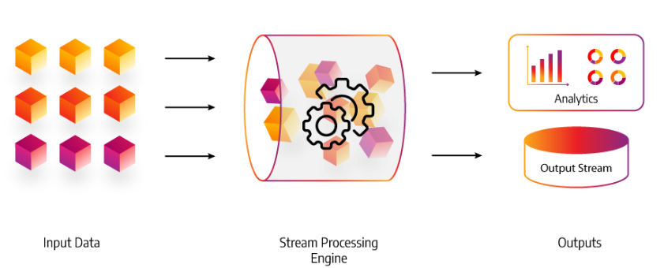
      </td>
    </tr>
  </table>

Los datos reservados en una base de datos de streaming pueden ser archivos de registro generados en la web, información de usuarios de plataformas de medios sociales, tendencias de usuarios de comercio electrónico, informes de actividad de usuarios en juegos o telemetría de diversos aparatos en centros de datos. Estos datos se procesan de forma secuencial e incremental y luego se utilizan para realizar análisis como regresión, filtrado, muestreo y correlación.

La posibilidad de analizar los datos en tiempo real da cabida a diversos casos de uso para diferentes sectores. Las empresas pueden hacer uso de este análisis y tomar decisiones relevantes basadas en los resultados del análisis. Consideremos el ejemplo de una organización en la que el análisis de las redes sociales se realiza a través de los recursos de una base de datos de streaming. La organización puede analizar fácilmente el comportamiento y la actividad de los usuarios. Esta observación puede ayudar a la empresa a tomar nuevas medidas basadas en los datos analizados para mejorar la eficiencia.

# 4. Bases de datos en streaming Vs Bases de datos relacionales tradicionales

Una de las principales diferencias entre el streaming y una base de datos relacional tradicional es el aspecto del tiempo real. Las bases de datos tradicionales son simplemente repositorios de datos, pero pueden funcionar junto con las bases de datos de streaming como caso de uso para grandes organizaciones. En este tipo de bases de datos, cuando se introducen los datos en columnas y tablas, los datos simplemente se integran en el sistema y no ocurre nada visual. Cuando se realiza una consulta, la base de datos tradicional simplemente la escanea y se declaran los resultados. Es ciega a cualquier proceso que ocurra entre la invocación de dos consultas en la base de datos.

Por otro lado, las bases de datos de streaming contrastan con las bases de datos tradicionales. Cuando se invoca una consulta, los datos se procesan inmediatamente, y este proceso actualiza los resultados de todas las consultas registradas. Se pueden leer todos los resultados de las consultas viendo los cambios en los datos. Esto puede denominarse una experiencia de aprendizaje continuo.


# 5. Materialize

Materialize es una "Streaming Data Base" que se utiliza para procesar y analizar datos en tiempo real, lo que también se conoce como "streaming data". El "streaming data" se refiere a flujos continuos de información que se generan a medida que ocurren eventos en tiempo real, como registros de sensores, transacciones financieras, actualizaciones de redes sociales, y más.

Materialize admite vistas materializadas actualizadas de forma incremental que siempre están actualizadas, incluso cuando se utilizan sentencias SQL complejas, como uniones multidireccionales con agregaciones. ¿Cómo? Su motor se basa en Timely y Differential Dataflow, marcos de procesamiento de datos respaldados por muchos años de investigación y optimizados para este propósito.

El "motor Timely" y "Differential Dataflow" son términos relacionados con el procesamiento de datos en tiempo real y la manipulación eficiente de flujos continuos de información.

El "motor Timely" se refiere a un marco de trabajo de procesamiento de datos en tiempo real que se utiliza para ejecutar operaciones en flujos de datos en paralelo. Este motor está diseñado para gestionar la sincronización y el ordenamiento de los eventos en tiempo real, lo que es esencial para garantizar que los datos se procesen de manera coherente y precisa. El enfoque "Timely" permite que las operaciones se realicen en el momento adecuado, asegurando que las dependencias y los resultados se manejen de manera eficiente y correcta.

Por otro lado, "Differential Dataflow" es un modelo de programación y procesamiento de datos que se utiliza para expresar cálculos complejos en flujos de datos que cambian con el tiempo. En esencia, Differential Dataflow permite definir transformaciones en los datos que se actualizan incrementalmente a medida que llegan nuevos eventos. Esto es particularmente útil en situaciones en las que los datos cambian constantemente y es necesario mantener cálculos y resultados actualizados de manera eficiente.

En conjunto, el "motor Timely" y "Differential Dataflow" son componentes clave en la construcción de sistemas de procesamiento de datos en tiempo real y análisis de flujos continuos de información. Estos enfoques permiten manejar eventos en tiempo real de manera eficiente y realizar cálculos complejos sobre flujos de datos que cambian constantemente, lo que resulta fundamental en aplicaciones que requieren análisis y toma de decisiones basados en eventos en tiempo real.

# 6. Ventajas

- **Procesamiento en tiempo real**: Materialize está diseñado para manejar datos en tiempo real y proporciona resultados instantáneos a medida que los datos fluyen, lo que es ideal para aplicaciones que requieren respuestas rápidas.
- **Consulta SQL**: Permite a los usuarios aprovechar sus habilidades existentes en SQL para realizar consultas y análisis en los datos en tiempo real, lo que facilita la adopción y el uso.
- **Actualizaciones automáticas**: Materialize realiza automáticamente actualizaciones incrementales a medida que llegan nuevos datos, lo que garantiza que los resultados sean siempre actualizados y precisos.
- **Optimización de rendimiento**: Utiliza técnicas de optimización para acelerar las consultas, lo que permite un procesamiento rápido incluso en conjuntos de datos grandes y complejos.

# 7. Desventajas

- **Complejidad de implementación**: Configurar y mantener una base de datos de transmisión como Materialize puede ser complejo y requerir conocimientos técnicos avanzados.
- **Recursos requeridos**: El procesamiento en tiempo real puede ser intensivo en recursos, lo que podría llevar a costos significativos en términos de hardware y escalabilidad.
- **Limitaciones de escala**: Aunque Materialize está diseñado para manejar grandes cantidades de datos en tiempo real, podría encontrar dificultades al manejar cargas extremadamente masivas o picos repentinos en la transmisión de datos.
- **Curva de aprendizaje**: A pesar de su enfoque en SQL, todavía puede haber una curva de aprendizaje para los usuarios nuevos que desean aprovechar al máximo todas las características y capacidades de Materialize.
          ```

# 8. Caso de Uso 

Imaginemos una empresa de comercio electrónico que desea realizar un seguimiento en tiempo real de las ventas de sus productos. Utilizando Materialize, podrían configurar una base de datos de transmisión para capturar y procesar los datos de ventas a medida que ocurren.

- **1. Configuración inicial**: La empresa configuraría Materialize para conectarse a sus fuentes de datos en tiempo real, como registros de transacciones de ventas y actualizaciones de inventario. Materialize comenzaría a procesar estos datos en tiempo real.

- **2. Definición de vistas materializadas**: Los analistas de la empresa podrían crear vistas materializadas utilizando consultas SQL. Por ejemplo, podrían crear una vista que muestre las ventas totales por producto en tiempo real, lo que permitiría a los equipos de ventas y marketing tomar decisiones informadas.

- **3. Consulta de datos en tiempo real**: Los usuarios podrían utilizar consultas SQL tradicionales para acceder a las vistas materializadas y obtener información en tiempo real sobre las ventas, inventario y otros indicadores clave. Estas consultas se ejecutarían sobre los datos procesados y actualizados por Materialize en tiempo real.

- **3. Actualizaciones automáticas**: A medida que llegan nuevas transacciones de ventas y actualizaciones de inventario, Materialize actualizaría automáticamente las vistas materializadas. Esto aseguraría que los informes y análisis siempre estén basados en datos frescos y precisos.

- **3. Respuestas rápidas**: Cualquier consulta realizada por los usuarios obtendría resultados instantáneos, ya que Materialize optimiza el rendimiento de las consultas y aprovecha los datos procesados en tiempo real.

En este escenario, Materialize permitiría a la empresa obtener información en tiempo real sobre sus ventas y tomar decisiones basadas en datos actualizados. Además, al utilizar SQL, los analistas y otros usuarios familiares con este lenguaje podrían aprovecharlo para realizar consultas y análisis sin necesidad de aprender una nueva sintaxis.

Sin embargo, es importante tener en cuenta que la implementación y configuración de Materialize requerirían un cierto nivel de experiencia técnica, y la empresa también debería considerar los recursos necesarios para el procesamiento en tiempo real y la escalabilidad a medida que sus operaciones crecen.

# 9. Demo

 - **A)** Nos registramos en Materialize, y esperamos el correo de activación, que puede tardar un poco. Una vez registrados y con la sesión iniciada, nos aparecerá la siguiente interfaz de Materialize. Primero de todo, os enseño la interfaz de Materialize.

<table>
  <tr>
    <td>
      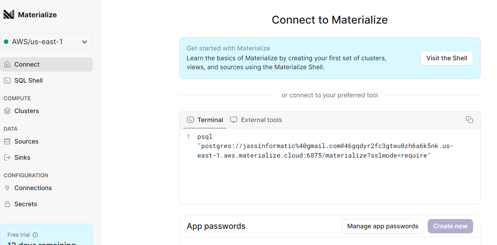
    </td>
  </tr>
</table>

- **B)** Una vez registrados, procedemos a la configuración de la demo. Primero de todo, vamos a crear dos Entornos de trabajo "Clusters", uno llamado "ingest_qck" para ingestar los datos dentro de Materialize y "compute_qck" para el calculo de los resultados finales, ya que es esencial para garantizar un procesamiento eficiente de datos. Y Una vez creados, comprobamos que se hayan creado bien:

        CREATE CLUSTER ingest_qck SIZE = '2xsmall';
        CREATE CLUSTER compute_qck SIZE = '2xsmall';
        SHOW CLUSTER REPLICAS WHERE cluster IN ('compute_qck', 'ingest_qck');

    SIZE: Aquí se define el tamaño del clúster en términos de recursos. "2xsmall" indica que el clúster tendrá la capacidad equivalente a dos unidades de recursos de tamaño "xsmall". La nomenclatura "xsmall" podría ser una categoría de recursos con cierta capacidad de procesamiento, memoria y almacenamiento.

<table>
  <tr>
    <td>
      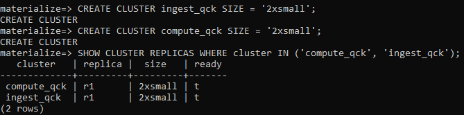
    </td>
  </tr>
</table>

- **C)** Una vez tenemos nuestros entornos de trabajo creados en Materialize, Vamos a ingresar los datos con los que trabajaremos. En este ejemplo Trabajaremos con un generador de carga integrado de Materialize que simula una casa de subastas, bueno, donde los usuarios pujan en una serie de subastas en directo. Pero antes de empezar, Materialize aconseja trabajar con esquemas porque ofrecen una forma organizada, segura y eficiente de administrar objetos de base de datos en tiempo real.

          CREATE SCHEMA qck;
          SET schema = qck;

<table>
  <tr>
    <td>
      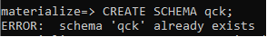
    </td>
  </tr>
</table>

- **D)** Una vez tenemos nuestro esquema, lo seleccionamos y todo seguido, Creamos la fuente de datos llamada "auction_house" en el clúster creado anteriormente "ingest_qck". Esta fuente de datos se conecta al generador de carga (LOAD GENERATOR) llamado "AUCTION", que simula la generación de datos en intervalos regulares. La instrucción "(TICK INTERVAL '500ms')" establece que se generarán eventos de datos en intervalos de 500 milisegundos.

            SET CLUSTER = ingest_qck;

            CREATE SOURCE auction_house
              IN CLUSTER ingest_qck
              FROM LOAD GENERATOR AUCTION
              (TICK INTERVAL '500ms')
              FOR ALL TABLES;

<table>
  <tr>
    <td>
      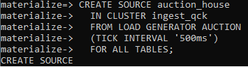
    </td>
  </tr>
</table>

- **E)** Ahora que hemos creado una fuente, podemos observar que Materialize comienza a ingerir datos en el almacenamiento, mostrando diferentes tablas. Como podemos observar. además de la fuente generadora de carga auction_house y sus subfuentes, veremos auction_house_progress, que Materialize crea para que podamos monitorizar la ingestión de fuentes.

            SHOW SOURCES;

<table>
  <tr>
    <td>
      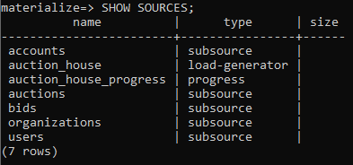
    </td>
  </tr>
</table>

- **F)** Como dijismos que vamos a trabajar con con tablas de subastas y sus respectivas pujas en tiempo real, VAMOS a ver un ejemplo hacernos la idea de como vienen los datos. Hacemos un select simple de cada una de ellas

            SELECT * FROM auctions LIMIT 1;
            SELECT * FROM bids LIMIT 1;

<table>
  <tr>
    <td>
      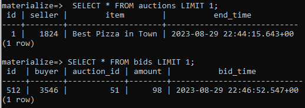
    </td>
  </tr>
</table>


- **G)**Ahora con las subastas a tiempo real, ya podemos ver el significado de Materialize calculando los resultados en tiempo real sobre datos que cambian rápidamente. Claro, pero primero de todo, cambiamos a nuestro otro Cluster creado anteriormente compute_qck que es donde pondremos los resultados. También activamos la función de temporización de "psql" para ver el tiempo, y la rapidez con la que se devuelven los resultados.

            SET CLUSTER = compute_qck;
            \timing

<table>
  <tr>
    <td>
      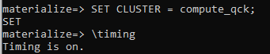
    </td>
  </tr>
</table>

- **H)** Una vez activado el timing y estamos en nuestro cluster adecuado, procedemos a crear la vista siguiente que une los datos de las subastas y las pujas para obtener el precio medio de las pujas que llegaron antes de que se cerraran las subastas. 

          CREATE VIEW avg_bids AS
            SELECT auctions.item, avg(bids.amount) AS average_bid
            FROM bids
            JOIN auctions ON bids.auction_id = auctions.id
            WHERE bids.bid_time < auctions.end_time
            GROUP BY auctions.item;

<table>
  <tr>
    <td>
      
    </td>
  </tr>
</table>

- **I)** Y todo seguido, vamos a hacer un SELECT de la vista, como podemos observar, podemos ver que cambia la puja media a medida que Materialize recibe nuevos datos de subastas. Pero, la vista recupera todos los datos del almacenamiento y calcula los resultados en el momento de la consulta, por lo que la latencia es alta y sería muchíssimo mayor con un conjunto mayor de datos.

                SELECT * FROM avg_bids;

<table>
  <tr>
    <td>
      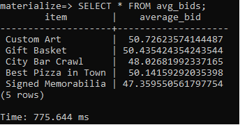
    </td>
  </tr>
</table>

<table>
  <tr>
    <td>
      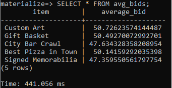
    </td>
  </tr>
</table>

ESTO ES MATERIALIZE.

- **J)** Una vez sabemos el concepto de Materialize y como funciona, podemos mejorar su rendimiento aun más, i aqui entra el concepto de los INDICES. Como todos sabemos,los indices sirven para mejorar el rendimiento y la eficiencia de las consultas en tiempo real. Y en Materialize ayudan a acelerar el acceso a los datos al proporcionar una estructura de datos optimizada que permite la búsqueda rápida y eficiente de información en una tabla.

    Claro, es aquí es donde Materialize se convierte realmente en una verdadera base de datos de streaming y juega un rol importante. Cuando se utiliza un índice, Materialize calcula incrementalmente los resultados de la consulta indexada en memoria a medida que llegan nuevos datos.

            CREATE INDEX avg_bids_idx ON avg_bids (item);

<table>
  <tr>
    <td>
      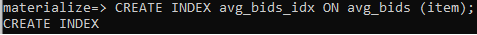
    </td>
  </tr>
</table>

    Como podemos observar, las ofertas medias siguen cambiando, pero ahora que la vista está indexada y los resultados se calculan previamente y se almacenan en memoria, ¡la latencia ha bajado a 100 milisegundos!


# 12. Possibles problemas

Claro, a veces queremos consultar las vistas desde diferentes clusters, entonces hay que tener en cuenta que los índices sólo existen en el clúster en el que se han creado. Nosotros anteriormente creamos el indice en el cluster "compute_qck". Para comprobarlo, vamos a cambiar al clúster predeterminado y vuelvemos a consultar la vista:

              SET CLUSTER = default;
              SELECT * FROM avg_bids;


Como podemos observar, la latencia vuelve a ser alta porque el índice que hemos creado en la vista sólo existe dentro del clúster "compute_qck". En el clúster por defecto, en el que nos encuentramos actualmente, no tenemos acceso a los resultados precalculados del índice. En su lugar, la vista recupera de nuevo los datos del almacenamiento y calcula los resultados en el momento de la consulta.
Para llegar a todos los clusters, hay que crear una vista vista materializada que persiste sus resultados en un almacenamiento duradero que es accesible a todos los clusters.

Si nos fijamos, ahora mismo estamos en el cluster por defecto, vamos a crear la misma vista anterior pero materializada, añadiendo el "Materialize":

El SELECT de esta vista materializada une datos de subastas y pujas, pero esta vez para obtener el número de pujas por artículo.

              CREATE MATERIALIZED VIEW num_bids AS
                SELECT auctions.item, count(bids.id) AS number_of_bids
                FROM bids
                JOIN auctions ON bids.auction_id = auctions.id
                WHERE bids.bid_time < auctions.end_time
                GROUP BY auctions.item;


Para comprobarlo, cambiamos de cluster y volvemos a lanzar la consulta:

              SET CLUSTER = compute_qck;
              SELECT * FROM num_bids;

Como puedemos ver, aunque la vista materializada se creó en el clúster predeterminado, sus resultados también están disponibles en otros clústeres porque se encuentran en un almacenamiento compartido y duradero.

              CREATE INDEX num_bids_idx ON num_bids (item);
              SELECT * FROM num_bids;

Ahora que la vista materializada sirve los resultados desde la memoria que tiene los datos consultados guardados, entonces la latencia vuelve a ser baja. 

Y esto es más o menos la Base de Datos de Materialize.

# 13. Bibliografia


